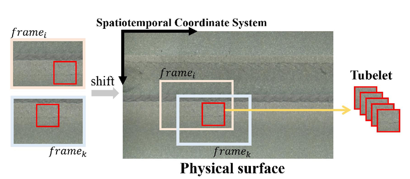

# tubelet-service

This is a gRPC service to store and query tubelets for object detection, classification 
and tracking in videos.

It is part of [the nuclear plant crack inspection processing pipeline](https://github.com/nhorro/nuclear-plant-crack-inspection-pipeline) that attempts to reproduce the paper *Deep Learning-based Crack Detection Using Convolutional Neural Network and Naıve Bayes Data Fusion.* [1] 

In this use scenario observations of patches classified as cracks or no cracks are clustered by spatial proximity and stored as a tubelet. 



## Motivation

### Problem description

Video footage of a scanned surface is obtained from a camera attached to a robotic arm[1] or from a drone that flys at a constant height. This surface might be a wall in which to search for defects or an aerial view to identify and count objects of interest.

In both scenarios the camera stays at constant distance from the surface, so the displacement is restricted to two axis.

Each video frame contains a partial view of the total surface to survey.

For each frame the object detector outputs a tuple containing:

- Probability of the detected object to belong to a certain class.
- Bounding box of the detected object.

All observations from succesive frames can then be grouped to improve the estimation ([1] uses Naive Bayes).

## Building instructions

### Build protobufs

C++:

```bash
cd src/proto
protoc -I . --grpc_out=.. --plugin=protoc-gen-grpc=`which grpc_cpp_plugin` tubelet_service.proto
protoc -I . --cpp_out=.. tubelet_service.proto
```

Python:

```bash
cd src/proto
pip install grpcio-tools
python -m grpc_tools.protoc -I . --python_out=../../python --grpc_python_out=../../python tubelet_service.proto
```

´´´

### conda/Eclipse

This project assumes conda is used for C++ development.
To use this project in Eclipse CDT, select Project->Import and then Build.
Run as local C/C++ application (binaries/tubelet-service).

### Build conda package

```bash
conda-build -c conda-forge conda-recipe
```

## Examples

[An example notebook](python/TubeletServiceTest.ipynb) is provided to test the service.

## TODO's

- Build protobufs. from Makefile.
- Publish in conda-cloud.
- Add Naive Bayes to tubelet query.

## References

- [1] Chen, Fu-Chen & Jahanshahi, Mohammad. (2017). NB-CNN: Deep  Learning-based Crack Detection Using Convolutional Neural Network and  Naïve Bayes Data Fusion. IEEE Transactions on Industrial Electronics. PP. 1-1. 10.1109/TIE.2017.2764844.
- [T-CNN: Tubelets with Convolutional Neural Networks for Object Detection from Videos](https://www.youtube.com/watch?v=kM6ZOA0GIwo)
